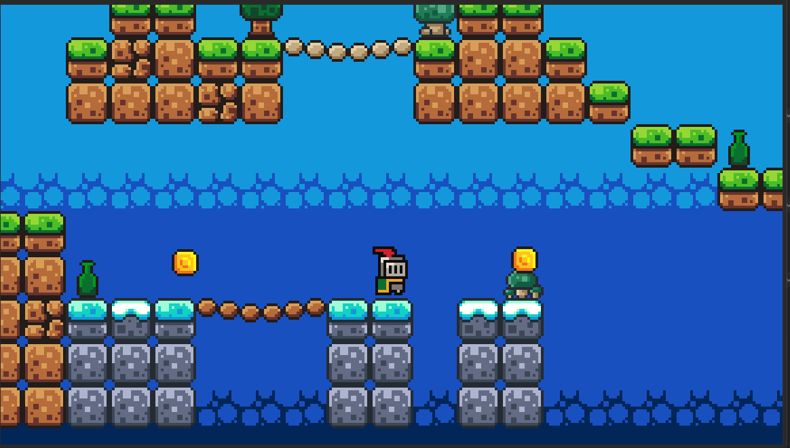
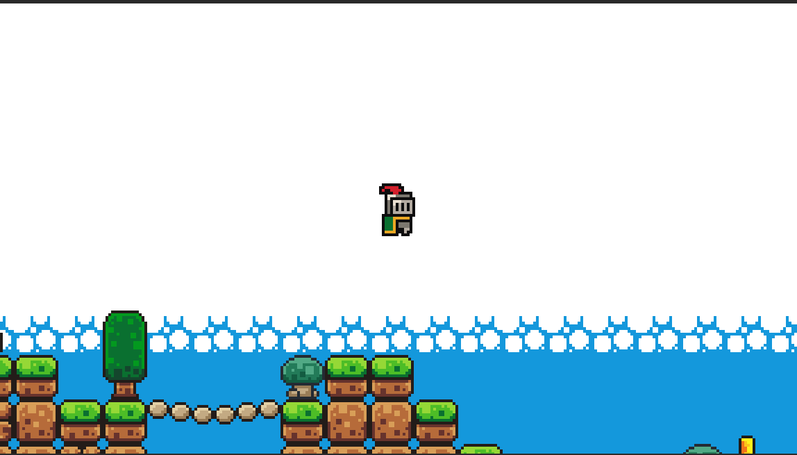

# knight king

A retro-style action adventure game featuring a knight on a quest to defeat enemies and navigate through challenging levels.

## Download

Download the game executable: [KnightKing.exe](gameexport/KnightKing.exe)

## Features

- Classic platformer gameplay mechanics
- Combat system with sword attacks
- Enemy encounters and boss battles
- Retro pixel art graphics
- Multiple levels to explore

## Installation

Clone the repository and run the game according to your platform's instructions.

## Controls

- Arrow keys: Move
- Space: Jump

## Contributing

Contributions are welcome. Please feel free to submit issues or pull requests.

## License

This project is open source and available under the MIT License.
